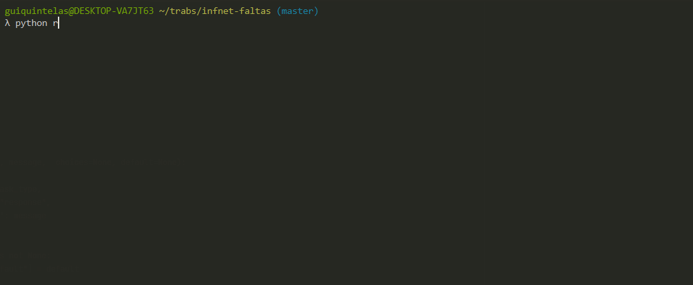
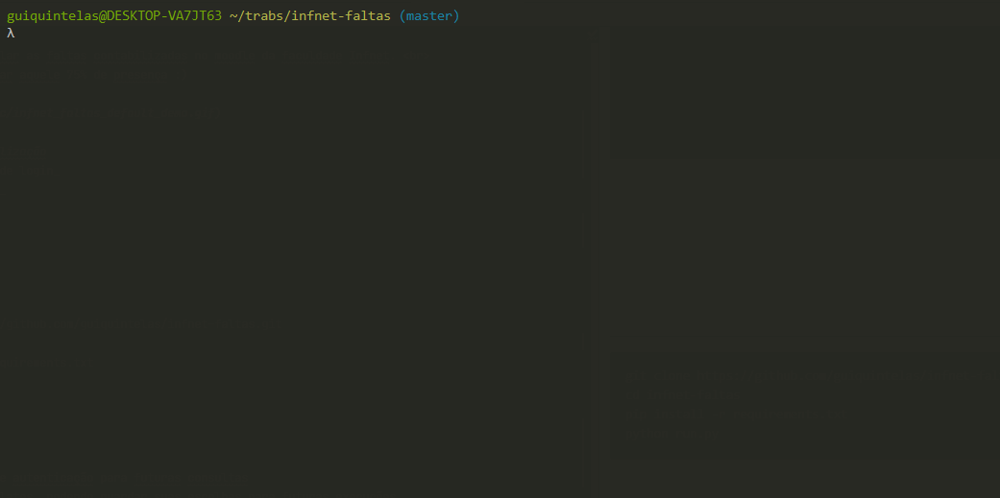
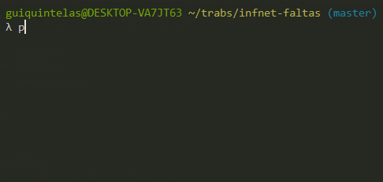

# infnet-faltas
Script para calcular as faltas contabilizadas no moodle da faculdade Infnet. <br>
Ajudando a otimizar aquele 75% de presença :)



#### Primeira Utilização  


_guardando dados de login_  
_criando template_

#### Deletando um Template  


## Instalação
 
```
git clone https://github.com/guiquintelas/infnet-faltas.git
cd infnet-faltas
pip install -r requirements.txt 
python run.py
```


## Features
- Guardar dados de autenticação para futuras consultas
- Sistema de templates, podendo guardar suas escolhas para futuras execuções  
- Possivel selecionar dentre essas categorias:
  - escola
  - curso
  - classe
  - bloco
  - materia
- Listando essas informações por materia
  - nome da materia
  - dias da semana
  - aulas dadas / total de aulas
  - frequencia atual
  - faltas
  - atrasos
  - dias nao lançados
  - faltas disponiveis
  - atrasos disponiveis
  
 
